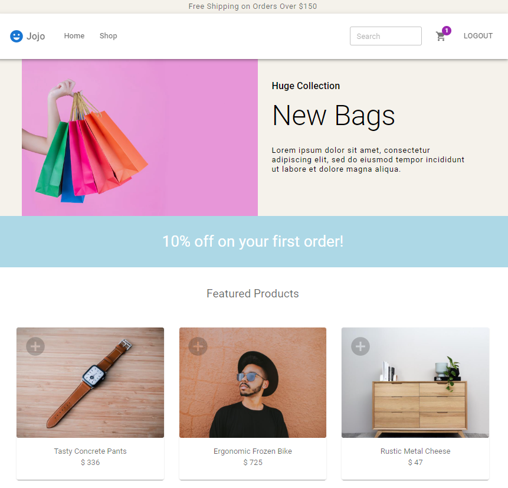
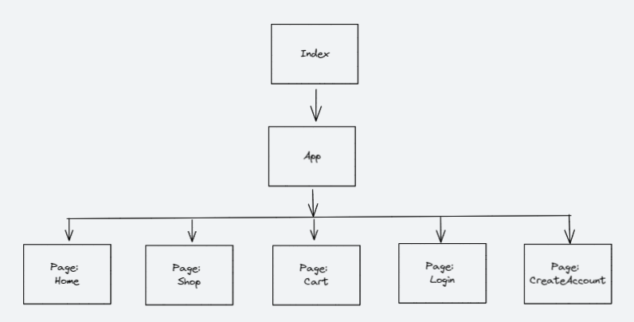
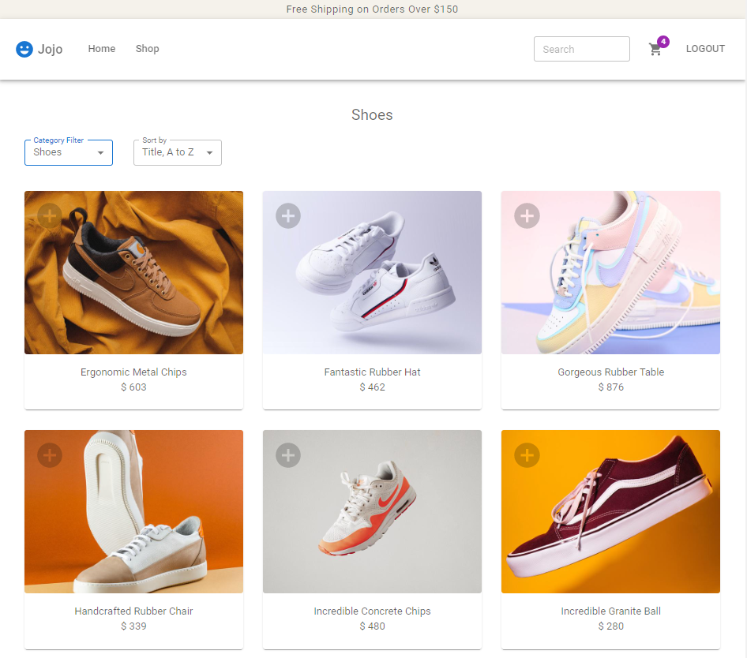
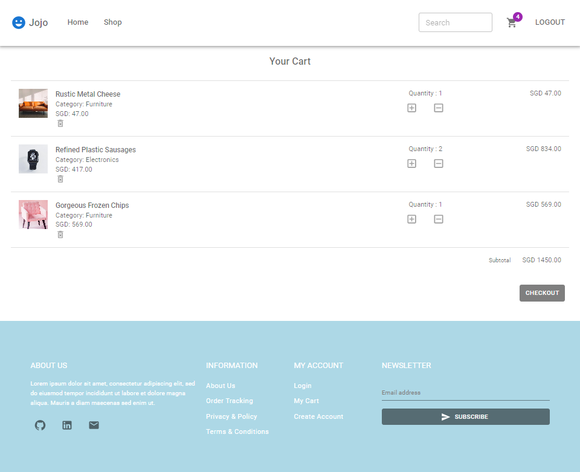
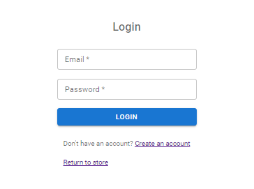
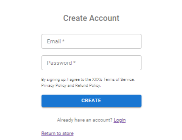

# JOJO shopping-website

An e-commerce website built with React and MUI (Material UI).

Features includes:

- Authentication (Create Account, Login and Logout)
- Add or remove item from Cart
- Searching of products by title.
- Filter items by Category
- Sort items alphabetically or numerically
- Responsive Web Design (Mobile Friendly)

Home Page: after logged in and add item to cart.
   

## Project Description

- ### Background:

  This project is a part of General Assembly's SEIF (Software Engineering Immersive Flex) Bootcamp course with following requirement:

  - Project Goal: Create a web app with React and everything we had learned so far (HTML, CSS, Javascript). It should read APIs data too.
  - Duration: 2 weeks.    

- ### Why this project?

  E-commerce websites are typically packed with many practical features. Choosing this as starting point allows me to learn while creating these features, meanwhile exposes me to some practical problems that developer would face when codes expands.

  In addition, taking this project as an opportunity I try to apply all the coding best practises(e.g. DRY, modularity, maintanable etc.) that I had learned so far.   

- ### How it works?

  Since the scope of this project is to create practical features of e-commerce website, most of the features here shall appear and function inituitively. With that in mind, only the features created in this project would be mentioned here.

  This is the simplified version of block diagram. Component that appears on different pages are reused and behave the same.

  Simplified Block Diagram:
  

  Home Page: see image ^

  - Announcement Bar.
  - Sticky Navigation Bar.
  - "LOGOUT" appear if logged in.
  - "Cart" Icon with badge showing total item added into cart.
  - Promotion Banner.
  - Auto slider.
  - Featured products.(click "+" icon to add item to cart.)
  - Controlled search of products by title.
      

  Shop Page:
  

  - Allows Category filtering and product sorting.
      

  Cart Page:
  

  - Add or remove product.
      

  Login Page: 
  
    

  Create Account Page: 
    

- ### Repository

  - Source code are stored in [github](https://github.com/hongyuanloo/jojo-shopping-website).
  - Application is hosted on [vercel](https://shopping-website-two.vercel.app/)

## Contact

I would appreciate any comments and feedback anyone has.
You can reach me at loohongyuan5505@hotmail.com.
